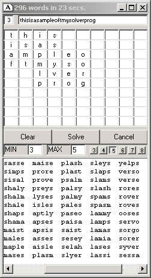

## Word Racer and Boggle Solver \(UPDATED\)

### Description

I developed this to solve 'Yahoo Word Racer' games. You can put in a 'letter grid' of any shape or size - even ones with HOLES such as in round 4. (right now up to 10X10) and it will solve all of the possible REAL words (using the included dictionary). It would also work fine for Boggle. Since Word Racer is a fast-paced game, I have it set to only solve 3,4, and 5 letter words (unless there is a 'QU' in there in which case it will also solve 6 letters)

One of the intersting things about my solver is that you can use groups of letters in each cell, and it could find words in combination of groups of letters.

If you want to have it solve longer words, simply add a new listbox to the lstWords array - giving it an index number equal to the number of letters wanted, and then modify the limits at the bottom of function "AddNextLetter"

Enjoy!
 
### More Info
 

             |
---                |---
**Submitted On**   |2002-04-26 10:09:08
**By**             |[Dave Andrews](https://github.com/Planet-Source-Code/PSCIndex/blob/master/ByAuthor/dave-andrews.md)
**Level**          |Advanced
**User Rating**    |5.0 (10 globes from 2 users)
**Compatibility**  |VB 5\.0, VB 6\.0
**Category**       |[Games](https://github.com/Planet-Source-Code/PSCIndex/blob/master/ByCategory/games__1-38.md)
**World**          |[Visual Basic](https://github.com/Planet-Source-Code/PSCIndex/blob/master/ByWorld/visual-basic.md)
**Archive File**   |[Word\_Racer760794262002\.zip](https://github.com/Planet-Source-Code/dave-andrews-word-racer-and-boggle-solver-updated__1-34107/archive/master.zip)

